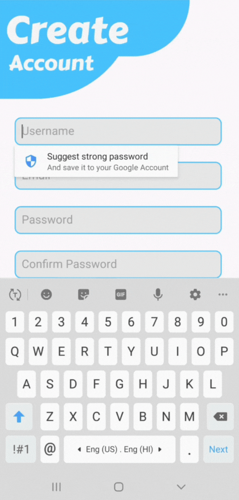
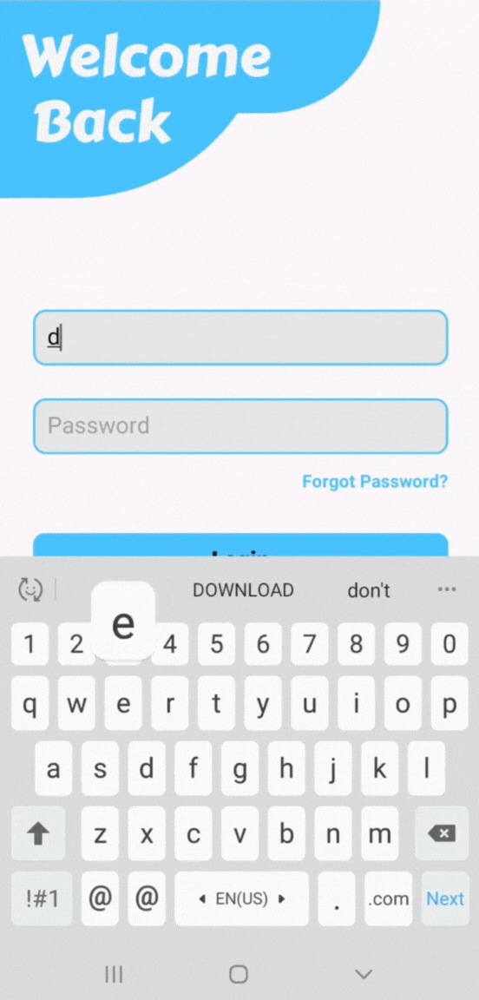

## 🔧 Built with modern Android tools and clean architecture


## ✨ Features

- 🔐 **User Authentication**  
  Secure login and sign-up using Firebase (Fragments)

- ➕ **Add Task**  
  Add tasks quickly and easily with a clean interface

- 📄 **Task Display**  
  View all tasks in a simple scrollable list

- ❌ **Delete Task**  
  Swipe to delete tasks effortlessly

- 🌑 **Light & Dark Theme Support**  
  Seamless switch between light and dark modes

- 📅 **Offline Friendly**  
  Works with local database using Room


---

## 📹 App Preview

### 🌀 Splash Screen


### 📅 Signup & Login

<table>
  <tr>
    <td></td>
    <td></td>
  </tr>
  <tr>
    <td align="center">Sign Up</td>
    <td align="center">Login</td>
  </tr>
</table>

### 🌜 Light & Dark Themes (Add Task)

<table>
  <tr>
    <td></td>
    <td></td>
  </tr>
  <tr>
    <td align="center">Light Mode</td>
    <td align="center">Dark Mode</td>
  </tr>
</table>

---
## 🛠️ Built With

- **Java**
- **MVVM Architecture**
- **Firebase Authentication**
- **Firestore Database**
- **Room Database**
- **XML Layouts**
- **Material 3 Theme (used in `themes.xml` as parent style)**
- **Vector Drawables (SVG Icons)**

## 📃 Dependencies Used
```
// Firebase BoM 
implementation(platform("com.google.firebase:firebase-bom:34.0.0"))

// Firebase Authentication
implementation("com.google.firebase:firebase-auth:24.0.0")

// Firestore
implementation("com.google.firebase:firebase-firestore:26.0.0")

// Room Database
implementation("androidx.room:room-runtime:2.7.2")
annotationProcessor("androidx.room:room-compiler:2.7.2")
```


---

## 📂 Sample Code (LoginFragment.java)
```
 FirebaseAuth auth = FirebaseAuth.getInstance();
 buttonLogin.setOnClickListener(new View.OnClickListener() {
            @Override
            public void onClick(View view) {
                String email = editTextEmailLogin.getText().toString().trim();
                String password = editTextPasswordLogin.getText().toString().trim();

                // Reset error messages before validation
                editTextEmailLogin.setError(null);
                editTextPasswordLogin.setError(null);


                if (email.isEmpty()) {
                    editTextEmailLogin.setError("Email is required!");
                }

                else if (password.isEmpty()) {
                    editTextPasswordLogin.setError("Password is required!");
                    iconPasswordVisibilityLogin.setVisibility(View.GONE);
                }

                else if (password.length() < 6) {
                    editTextPasswordLogin.setError("Password must be at least 6 characters!");
                    iconPasswordVisibilityLogin.setVisibility(View.GONE);
                }

                else {
                    buttonLogin.setEnabled(false);
                    buttonLogin.setText("");
                    progressBarLoginFragment.setVisibility(View.VISIBLE);

                    new Handler(Looper.getMainLooper()).postDelayed(new Runnable() {
                        @Override
                        public void run() {
                            SharedPreferences sharedPreferences = requireContext().getSharedPreferences("MyPrefs", Context.MODE_PRIVATE);
                            SharedPreferences.Editor editor = sharedPreferences.edit();
                            editor.putBoolean("isLoggedIn", true);
                            editor.apply();

                            progressBarLoginFragment.setVisibility(View.GONE);
                            auth.signInWithEmailAndPassword(email, password)
                                    .addOnCompleteListener(task -> {
                                        if(task.isSuccessful())
                                        {
                                            FirebaseUser user = auth.getCurrentUser();
                                            Intent intent = new Intent(getActivity(), DoNowMain.class);
                                            startActivity(intent);
                                            requireActivity().finish();
                                        }
                                        else {
                                            Toast.makeText(getContext(), "Login Failed: " + task.getException().getMessage(), Toast.LENGTH_SHORT).show();
                                        }
                                    });
                            buttonLogin.setText("Login");
                            buttonLogin.setEnabled(true);
                        }
                    }, 1500);
                }
            }
        });
```

---
📚 More Projects <br>
Check out more of my projects on my [GitHub profile](https://github.com/Saswat-King)
  
